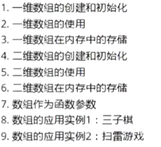

# 数组的创�?
数组是一组相同类型元素的组合 数组的创建方�?:
type_t arr_name [const_n];
//type_t 是指数组的元素类�?
//const_n 是一个常量表达式 用来指定数组的大�?

1.strlen和sizeof没有什么关�?

2.strlen是求字符串长度的 - 只能针对字符串求长度 - 库函�? - 使用得引用头文件

3.sizeof计算变量、数组、类型的大小�? - 单位是字�? -  操作�?

一维数组在内存中空间是连续�?

二维数组行可以省 列不可以�?

4.break语句只用于for和switch 在if语句中不能使�? 因为if不是循环语句 所以不能用break来结�?

        //这部分中用break是因为这块if语句包含在for循环�?
         if(flag == 1)
         {
             break;
         }
        

