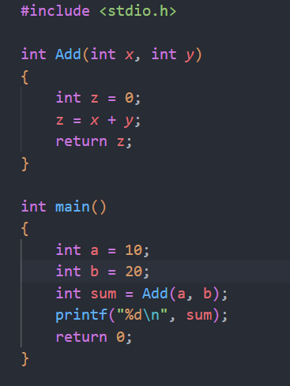
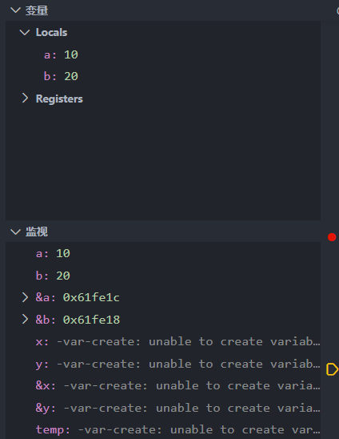
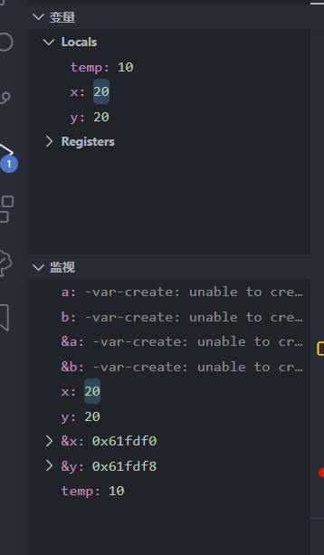
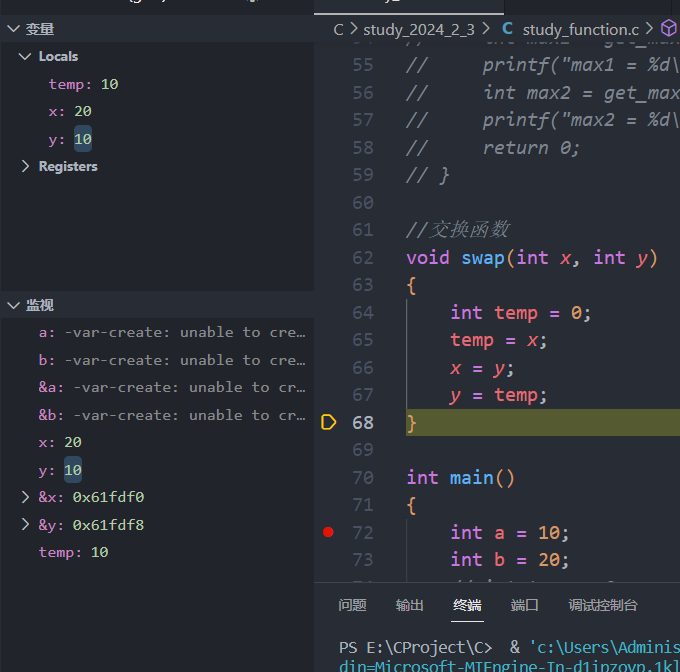
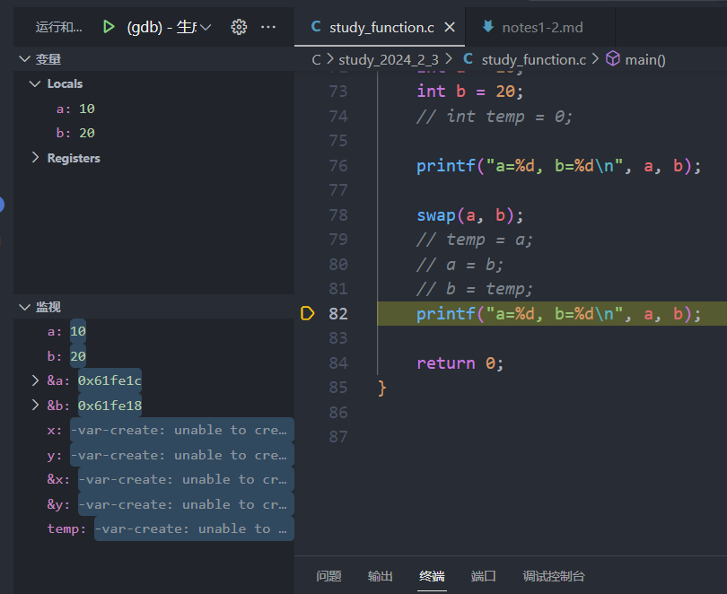
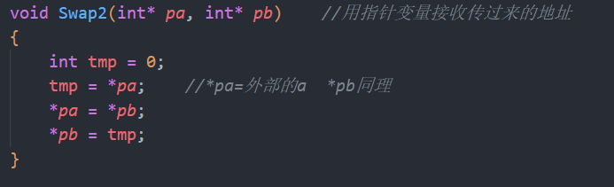
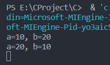

# 函数

## 提供了对过程的封装
 

此处函数必须在主函数之上

## 值传递、地址传递

可以看出 x y a b 都有自己的独立空间
希望x y 与 外部的 a b建立联系

## 实参：

真实传给函数的参数，叫实参。可以是常量、变量、表达式、函数等。无论实参是何种类型的量，在进行函数调用时，它们都必须有明确的值，以便把值传递给形参。

## 形参：

形参是指函数名后括号中的变量，因为形式参数只有在函数被调用的过程中才实例化（分配内存单元），所以叫形式参数。形参当函数调用完后就自动销毁了。因此形参只在函数中有效

## 函数的调用
### 传值调用

函数的形参和实参分别占有不同的内存块，对形参的修改不会影响实参

### 传址调用

1.把函数外部创建的变量地址传递给函数
2.可以让函数内外变量建立起真正的连接，也就是函数内部可以直接操作函数外部的变量

注意: 数组作为形参时不可以用sizeof计算它的字长

