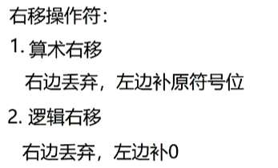

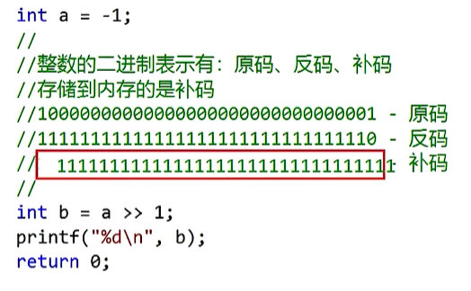

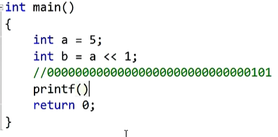

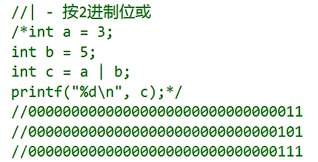

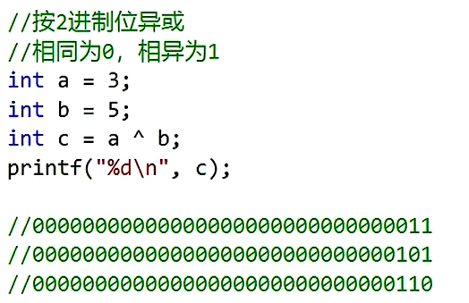

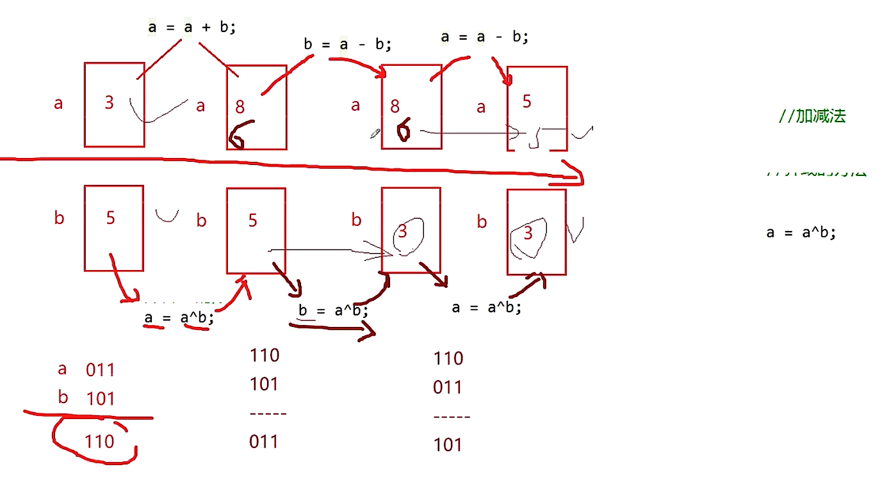

     //交换两个int变量的值 不能使用第三个变量
    // 即a=3 b=5 交换之后a=5 b=3
    int a = 3;
    int b = 5;
    int tmp = 0;//临时变量
    printf("before: a=%d b=%d\n", a, b);
    tmp = a;
    a = b;
    b = tmp;

    //加减法-可能会溢出
    // a = a + b;
    // b = a - b;
    // a = a - b;

    //异或的方法
    a = a ^ b;
    b = a ^ b;
    a = a ^ b;
    printf("after: a=%d b=%d\n", a, b);

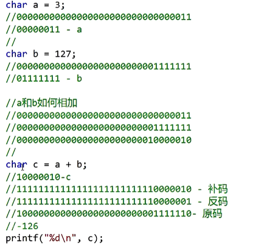
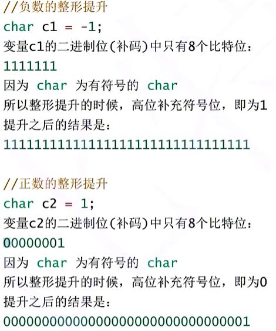

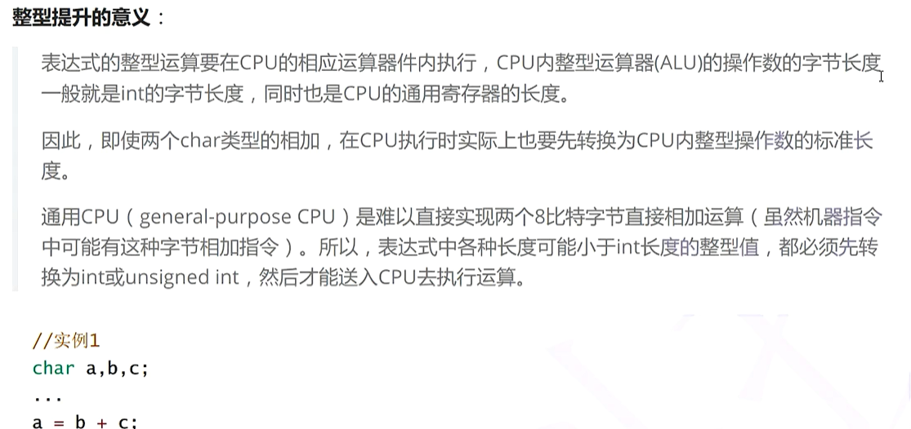

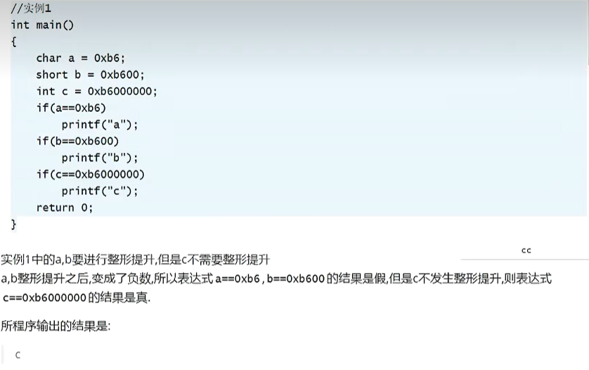

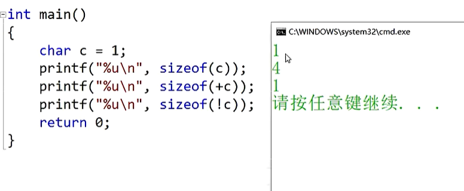
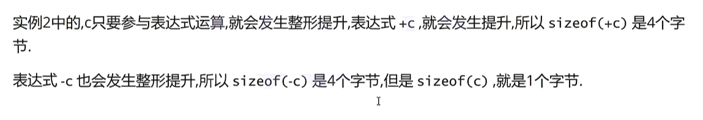

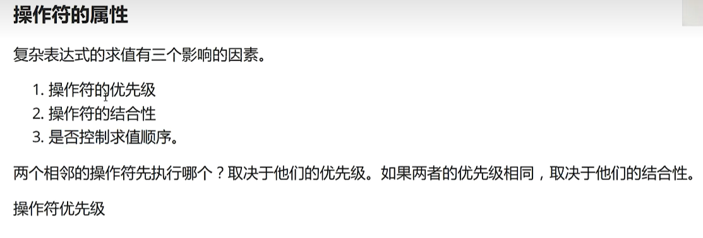
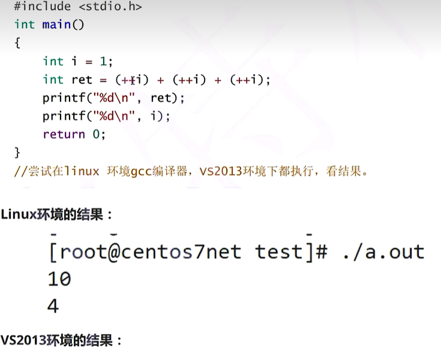